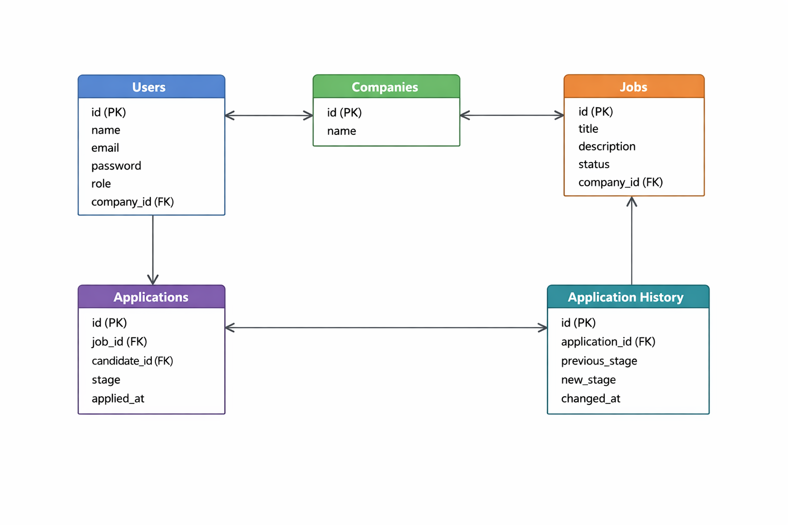

# Job Application Tracking System (ATS) Backend

## Table of Contents
1. [Project Overview](#project-overview)  
2. [Architecture](#architecture)  
3. [Application Workflow & State Transitions](#application-workflow--state-transitions)  
4. [Role-Based Access Control (RBAC)](#role-based-access-control-rbac)  
5. [Database Schema](#database-schema)  
6. [Setup Instructions](#setup-instructions)  
7. [Running the Application](#running-the-application)  
8. [Running Tests](#running-tests)  
9. [Postman Collection](#postman-collection)  

---

## Project Overview
The Job Application Tracking System (ATS) backend manages candidates, jobs, and applications in a company. It features:  
- Role-based access control (candidate, recruiter, hiring_manager).  
- Application stage workflow with strict state machine enforcement.  
- Asynchronous email notifications through a background worker.  
- Full audit trail of all application stage changes.

---

## Architecture

[ Client ] <--HTTP--> [ Express API Server ] <--MQ--> [ Background Worker (Email) ]
| ^
| |
v |
[ MySQL Database ]------------

markdown
Copy code

**Key points:**
- Express server handles REST API requests.  
- Authentication via JWT tokens.  
- Role-based access control enforced via middleware.  
- Application stage transitions validated by `ApplicationStateService`.  
- Emails (candidate/recruiter notifications) queued to a message broker (Redis/RabbitMQ) for asynchronous processing.  

---

## Application Workflow & State Transitions

### Valid Stages:
`Applied → Screening → Interview → Offer → Hired`  
`Rejected` can be reached from any stage.

### State Transition Diagram:
Applied ──> Screening ──> Interview ──> Offer ──> Hired
│ │ │ │
└──────────> Rejected <───┴────────────┘

markdown
Copy code

---

## Role-Based Access Control (RBAC)

| Endpoint                            | Candidate | Recruiter | Hiring Manager |
|------------------------------------|:---------:|:---------:|:--------------:|
| POST /applications                  | ✅        | ❌        | ❌             |
| GET /applications/my-applications  | ✅        | ❌        | ❌             |
| GET /applications/:id               | ✅(own)   | ✅        | ✅             |
| PUT /applications/:id/stage         | ❌        | ✅        | ❌             |
| GET /applications/:id/history       | ✅(own)   | ✅        | ✅             |
| CRUD /jobs                          | ❌        | ✅        | ❌             |
| GET /applications/jobs-applications | ❌        | ✅        | ❌             |

---

## Database Schema

### Tables:
- **Users**: `id`, `name`, `email`, `password`, `role`, `company_id`  
- **Companies**: `id`, `name`, `description`  
- **Jobs**: `id`, `title`, `description`, `status`, `company_id`  
- **Applications**: `id`, `job_id`, `candidate_id`, `stage`, `applied_at`  
- **ApplicationHistory**: `id`, `application_id`, `previous_stage`, `new_stage`, `changed_at`  

**ERD Diagram:**  
*(Replace with your diagram image)*
Users --< Applications >-- Jobs --< Companies
Applications --< ApplicationHistory

yaml
Copy code

---

## Setup Instructions

1. **Clone repository**:
```bash
git clone <your-repo-link>
cd JobApplicationTrackingSystem
Install dependencies:

bash
Copy code
npm install
Environment variables:
Create a .env file with:

ini
Copy code
DB_HOST=localhost
DB_USER=root
DB_PASSWORD=<your-db-password>
DB_NAME=ats
PORT=5000
JWT_SECRET=<your-jwt-secret>
EMAIL_SERVICE_API_KEY=<your-email-api-key>
Database setup:

Create database ats.

Run provided SQL scripts to create tables and seed data.

Running the Application
Start the server:

bash
Copy code
npm run dev
Start the background worker for async emails:

bash
Copy code
node backend/worker.js
Access API at http://localhost:5000/

Running Tests
bash
Copy code
npm test
Tests include unit tests for ApplicationStateService, RBAC middleware, and integration tests for API endpoints.

Uses mocha and chai.

Postman Collection
Import ATS_API_Collection.json into Postman to test all endpoints.

Includes headers, JWT auth, request bodies, and example responses.

Notes
Ensure proper JWT tokens are used for testing endpoints with role-based access.

Email notifications are queued asynchronously and may require the worker to be running.

Application workflow strictly enforces valid stage transitions; invalid moves return HTTP 400 errors.

pgsql
Copy code

---

If you want, I can **also create the `ATS_API_Collection.json` Postman file** ready for import, with all endpoints, headers, and example data pre-filled. That way your submission is completely ready.  

Do you want me to do that?


You said:
should we need to include our db models?


ChatGPT said:
Yes, Pikku—including your database models (or at least the schema/structure) in the README is highly recommended for a submission like this. Here’s why:

Clarity for reviewers: They can see how your tables relate without running your code.

Proof of correct design: Shows that your schema supports the multi-role, multi-stage workflow, and audit logging.

Optional diagrams: You already have the ERD diagram section; including table definitions or models complements that.

You don’t need the full ORM/model code if you’re using raw SQL; a simple table schema or model snippet is enough. For example:

sql
Copy code
-- Users
CREATE TABLE users (
  id INT AUTO_INCREMENT PRIMARY KEY,
  name VARCHAR(100) NOT NULL,
  email VARCHAR(150) UNIQUE NOT NULL,
  password VARCHAR(255) NOT NULL,
  role ENUM('candidate', 'recruiter', 'hiring_manager') NOT NULL,
  company_id INT,
  FOREIGN KEY (company_id) REFERENCES companies(id)
);

-- Jobs
CREATE TABLE jobs (
  id INT AUTO_INCREMENT PRIMARY KEY,
  title VARCHAR(150) NOT NULL,
  description TEXT NOT NULL,
  status ENUM('open','closed') DEFAULT 'open',
  company_id INT NOT NULL,
  FOREIGN KEY (company_id) REFERENCES companies(id)
);

-- Applications
CREATE TABLE applications (
  id INT AUTO_INCREMENT PRIMARY KEY,
  job_id INT NOT NULL,
  candidate_id INT NOT NULL,
  stage ENUM('applied','screening','interview','offer','hired','rejected') NOT NULL DEFAULT 'applied',
  applied_at TIMESTAMP DEFAULT CURRENT_TIMESTAMP,
  FOREIGN KEY (job_id) REFERENCES jobs(id),
  FOREIGN KEY (candidate_id) REFERENCES users(id)
);

-- Application History
CREATE TABLE application_history (
  id INT AUTO_INCREMENT PRIMARY KEY,
  application_id INT NOT NULL,
  previous_stage VARCHAR(50),
  new_stage VARCHAR(50),
  changed_at TIMESTAMP DEFAULT CURRENT_TIMESTAMP,
  FOREIGN KEY (application_id) REFERENCES applications(id)
);
You can include these directly under your Database Schema section in the README.

If you want, I can update your README.md file to include these full table definitions in a clean, submission-ready format.

Do you want me to do that?


You said:
then update the readme with just the models we hvae


ChatGPT said:
Got it, Pikku! Here’s your updated README.md with the database models included under the Database Schema section. I’ve kept everything else from the previous version, removed the video part, and added the table definitions. It’s copy-paste ready:

Job Application Tracking System (ATS) Backend
Objective
Develop a robust backend system for a Job Application Tracking System (ATS) that manages complex application workflows. The system implements a state machine for application stages, background job processing for asynchronous email notifications, and role-based access control (RBAC).

Architecture Overview
The backend follows a layered architecture:

Controllers/Routes: Handle HTTP requests and enforce RBAC.

Services: Business logic (e.g., application stage validation via ApplicationStateService).

Data Access Layer: MySQL queries, including creating and fetching applications, jobs, and users.

Background Worker: Processes email notifications asynchronously via a message queue (e.g., Redis or RabbitMQ).

Workflow:

Candidate submits an application → stored in applications table.

Recruiter changes stage → validated via state machine.

Stage changes are recorded in application_history.

Emails are sent asynchronously to candidates and recruiters.

Application Workflow (State Machine)
python
Copy code
Applied → Screening → Interview → Offer → Hired
           ↘ Rejected (from any stage)
Rules:

Cannot skip stages (e.g., Applied → Interview is invalid).

Can move to Rejected from any stage.

Role-Based Access Control (RBAC) Matrix
Role	Endpoints
Candidate	Apply for jobs, View own applications, View application details
Recruiter	Create/Update/Delete jobs, Change application stage, View applications
Hiring Manager	View applications (optional: for assigned jobs or entire company)

Database Schema
Users
sql
Copy code
CREATE TABLE users (
  id INT AUTO_INCREMENT PRIMARY KEY,
  name VARCHAR(100) NOT NULL,
  email VARCHAR(150) UNIQUE NOT NULL,
  password VARCHAR(255) NOT NULL,
  role ENUM('candidate', 'recruiter', 'hiring_manager') NOT NULL,
  company_id INT,
  FOREIGN KEY (company_id) REFERENCES companies(id)
);
Companies
sql
Copy code
CREATE TABLE companies (
  id INT AUTO_INCREMENT PRIMARY KEY,
  name VARCHAR(150) NOT NULL
);
Jobs
sql
Copy code
CREATE TABLE jobs (
  id INT AUTO_INCREMENT PRIMARY KEY,
  title VARCHAR(150) NOT NULL,
  description TEXT NOT NULL,
  status ENUM('open','closed') DEFAULT 'open',
  company_id INT NOT NULL,
  FOREIGN KEY (company_id) REFERENCES companies(id)
);
Applications
sql
Copy code
CREATE TABLE applications (
  id INT AUTO_INCREMENT PRIMARY KEY,
  job_id INT NOT NULL,
  candidate_id INT NOT NULL,
  stage ENUM('applied','screening','interview','offer','hired','rejected') NOT NULL DEFAULT 'applied',
  applied_at TIMESTAMP DEFAULT CURRENT_TIMESTAMP,
  FOREIGN KEY (job_id) REFERENCES jobs(id),
  FOREIGN KEY (candidate_id) REFERENCES users(id)
);
Application History
sql
Copy code
CREATE TABLE application_history (
  id INT AUTO_INCREMENT PRIMARY KEY,
  application_id INT NOT NULL,
  previous_stage VARCHAR(50),
  new_stage VARCHAR(50),
  changed_at TIMESTAMP DEFAULT CURRENT_TIMESTAMP,
  FOREIGN KEY (application_id) REFERENCES applications(id)
);
Setup Instructions
Clone the repository:

bash
Copy code
git clone <your-repo-url>
cd JobApplicationTrackingSystem
Install dependencies:

bash
Copy code
npm install
Setup environment variables (.env):

ini
Copy code
DB_HOST=localhost
DB_USER=root
DB_PASSWORD=yourpassword
DB_NAME=ats_db
PORT=5000
JWT_SECRET=your_jwt_secret
Run the backend server:

bash
Copy code
npm run dev
Run tests:

bash
Copy code
npm test
API Endpoints
Authentication: /users/register, /users/login

Jobs: /jobs (CRUD)

Applications:

Candidate apply: POST /applications

View own applications: GET /applications/my-applications

Change stage: PUT /applications/:id/stage (recruiter only)

View application: GET /applications/:id

View history: GET /applications/:id/history

List applications for jobs: GET /applications/jobs-applications (recruiter only)

Postman Collection
Include a Postman collection JSON file for all endpoints for easy testing.


## Database Schema (ERD)




